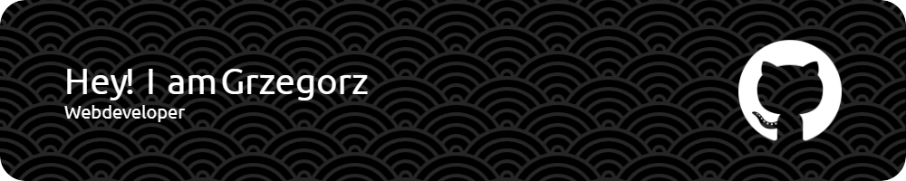

<!-- HERO SECTION -->

  

<h1 align="center">Cześć, jestem gb-redRabit 👋</h1>

  <b>Technik informatyk</b> zainteresowany frontendem i backendem. 
  <i>Koduję, uczę się, eksperymentuję — od weba po desktop!</i>

<!-- SNAKE ANIMATION -->
<picture align="center">
  <source media="(prefers-color-scheme: dark)" srcset="https://raw.githubusercontent.com/gb-redRabit/gb-redRabit/output/github-contribution-grid-snake-dark.svg">
  <source media="(prefers-color-scheme: light)" srcset="https://raw.githubusercontent.com/gb-redRabit/gb-redRabit/output/github-contribution-grid-snake.svg">
  
</picture>

---

  <!-- Quick badges -->
  
  
  

---

## 🔧 Umiejętności i technologie

  &nbsp;
  &nbsp;
  &nbsp;
  &nbsp;
  
  &nbsp;
  &nbsp;
  &nbsp;
  
  &nbsp;
  
  
  
  
  
  &nbsp;
  &nbsp;
  &nbsp;
  &nbsp;
  

---

## 🚀 Najważniejsze projekty

<table align="center" style="border-collapse:collapse;">
  <tr>
    <td align="center" style="padding:12px 18px">
      <a href="https://github.com/gb-redRabit/app-quize">
         
        <strong>app-quize</strong>
      </a>
    </td>
    <td align="center" style="padding:12px 18px">
      <a href="https://github.com/gb-redRabit/nami">
         
        <strong>nami</strong>
      </a>
    </td>
  </tr>
</table>

---

## 🎯 Co mnie wyróżnia

- Praktyczne podejście: od projektu UI po implementację backendu  
- Łączenie web + aplikacje desktopowe (Electron)  
- Zamiłowanie do optymalizacji frontendu i narzędzi buildujących

---

## 🎧 Po pracy

Muzyka, kuchnia azjatycka, gry karciane i planszowe — źródła pomysłów i relaksu.

---

## 💬 Ulubiony cytat

> "Tylko dwie rzeczy są nieskończone: wszechświat oraz ludzka głupota, choć nie jestem pewien co do tej pierwszej."  
> — Albert Einstein

---

## ✉️ Kontakt

Najprościej: zostaw issue w jednym z repozytoriów lub napisz w projekcie, którym jesteś zainteresowany.

---
